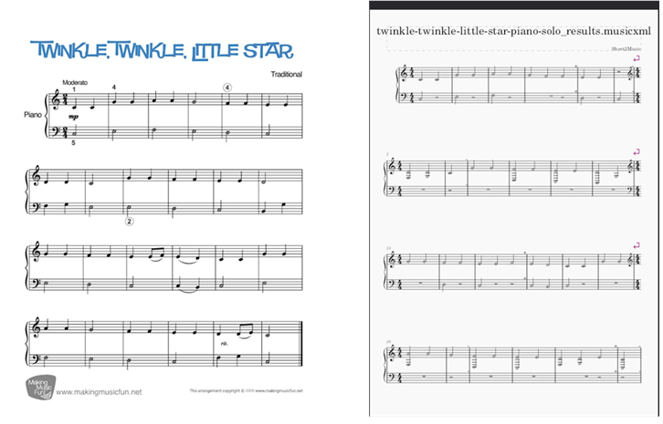

# Sheet2Music

## Purpose
Sheet2Music is a project that applies Deep Learning models and Computer Vision to build an end-to-end pipeline in order to convert sheet music to PDF format in MusicXML format, then to sound in MIDI. It combines deep learning models with natural language processing to create music in MIDI or MP3 format and visual outputs like spectrograms in PNG format, offering a creative tool for musicians and developers.

## Features
- **File Convert**: Uses different Deep learning models to process a PDF file into a MIDI
- **Visualizations with MUSICXML**: Can see the result through MusicXML file format, but **require MuseScore application**
- **Interactive Interface**: Provides a `streamlit`-based web app to generate and view outputs.
- **End-to-End Process**: The User only needs to throw the sheet into the application and wait for the magic to come.

## Results
### Audio Sample
[twinkle-twinkle-little-star-piano-solo_results.webm](https://github.com/user-attachments/assets/0e6ce694-cc03-4c2e-894b-370f458af384)

### Visualization
A spectrogram of the generated music:


*Note*: Find these files in the `assets/` folder after cloning the repository.

## Implementation
Follow these steps to set up and run Sheet2Music.

### Prerequisites
- Python 3.10
- Conda
- Git
- NVIDIA GPU (optional, for CUDA acceleration)

### Setup Instructions
1. **Clone the Repository**:
   ```bash
   git clone https://github.com/essor1234/Sheet2Music_GUI.git
   cd Sheet2Music_GUI

2. **Set Up Conda Environment:**:
   ```bash
   conda create --name sheet2music --file requirements.txt
   conda activate sheet2music
   
3. **Run the Project:**:
   ```bash
   streamlit run app.py
### Future Enhancement
- Update the pipeline for a more advanced process, which can help detect based on the relationship of notes
- Use better models and prepare more data to improve accuracy
- Consider using different approaches to improve the efficiency
